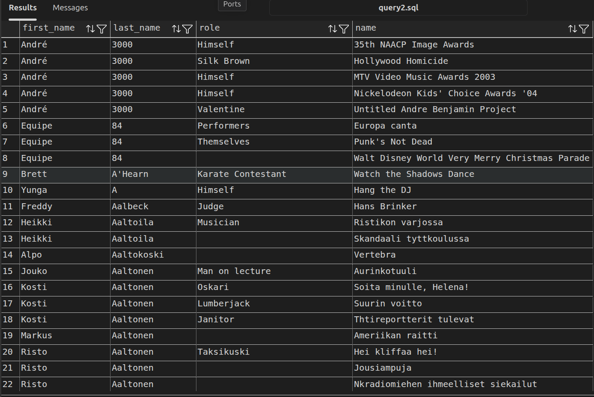

# DATABASE

# SQL

Proses SELECT Table with join for acces many table

1. TO ACCES GENRES & DIRECTOR  from MOVIES must join "movies_directors", "directors", & "movies_genres" relations is 
"movie_id"

2. TO ACCES MOVIES & ROLES  from ACTORS must join "roles", & "movies" relations is 
"movie_id"

